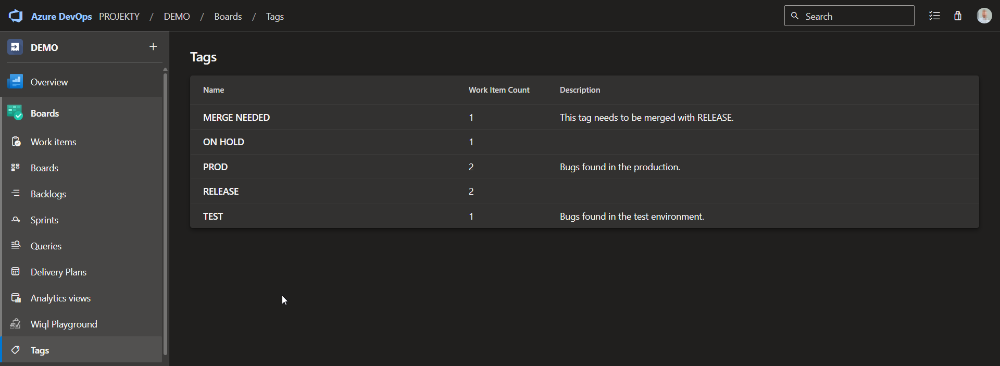

# About the extension
TODO.

# Features
TODO

# Setup
After installing the extension from the Marketplace, you need to enable it in the **Manage features**  section. In order to do so, follow the instructions [here](https://learn.microsoft.com/en-us/azure/devops/project/navigation/preview-features?view=azure-devops).

# Support
Email us at [info.emait@gmail.com](mailto:info.emait@gmail.com) for any help on this extension or if you would like to request a new feature.